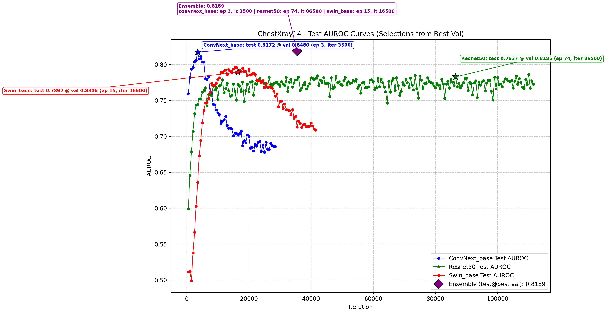
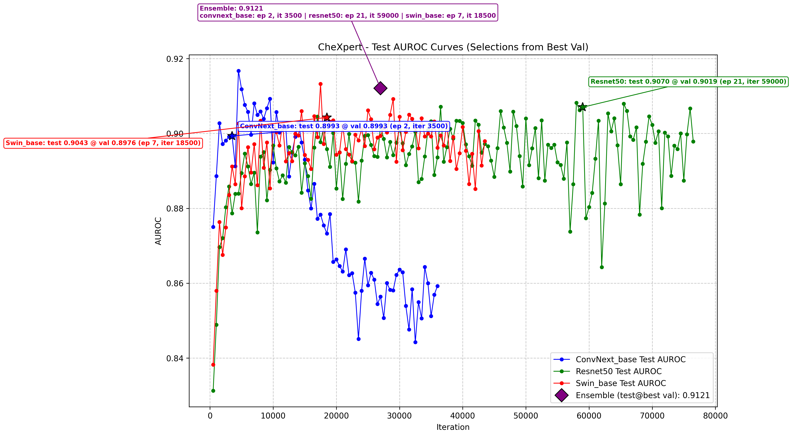
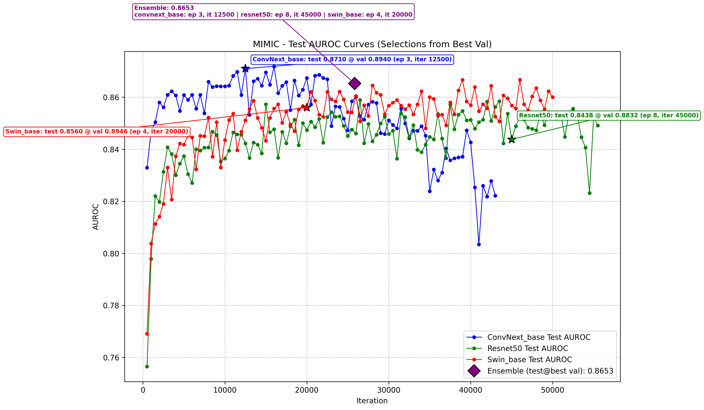

# Results Summary - Best Test AUROC
each backbone at its OWN best test epoch, ensemble averages those preds

### AUROC

|                          | CheXpert   | ChestXray14   | MIMIC   |
|:-------------------------|:-----------|:--------------|:--------|
| ConvNext_base            | 0.9167     | 0.8172        | 0.8718  |
| Resnet50                 | 0.9082     | 0.7861        | 0.8590  |
| Swin_base                | 0.9132     | 0.7964        | 0.8667  |
| **Ensemble (best test)** | 0.9207     | 0.8197        | 0.8761  |

### Epoch/Iter per Architecture in Ensemble

|                          |   CheXpert |   ChestXray14 |   MIMIC |
|:-------------------------|-----------:|--------------:|--------:|
| ConvNext_base epoch used |          2 |             3 |       3 |
| ConvNext_base iter used  |       4500 |          3500 |   16000 |
| Resnet50 epoch used      |         20 |            94 |       5 |
| Resnet50 iter used       |      58000 |        110000 |   26500 |
| Swin_base epoch used     |          7 |            14 |       7 |
| Swin_base iter used      |      17500 |         15500 |   39000 |

---

# Test AUROC @ Best Val
each backbone at its OWN best val epoch, ensemble averages those test preds

### AUROC

|                              | CheXpert   | ChestXray14   | MIMIC   |
|:-----------------------------|:-----------|:--------------|:--------|
| ConvNext_base                | 0.8993     | 0.8172        | 0.8710  |
| Resnet50                     | 0.9070     | 0.7827        | 0.8438  |
| Swin_base                    | 0.9043     | 0.7892        | 0.8560  |
| **Ensemble (test@best val)** | 0.9121     | 0.8189        | 0.8653  |

### Epoch/Iter per Architecture in Ensemble

|                          |   CheXpert |   ChestXray14 |   MIMIC |
|:-------------------------|-----------:|--------------:|--------:|
| ConvNext_base epoch used |          2 |             3 |       3 |
| ConvNext_base iter used  |       3500 |          3500 |   12500 |
| Resnet50 epoch used      |         21 |            74 |       8 |
| Resnet50 iter used       |      59000 |         86500 |   45000 |
| Swin_base epoch used     |          7 |            15 |       4 |
| Swin_base iter used      |      18500 |         16500 |   20000 |

---

## Plots — Best Test AUROC

### ChestXray14

### CheXpert

### MIMIC

---

## Plots — Test AUROC at Best Val

### ChestXray14

### CheXpert

### MIMIC

