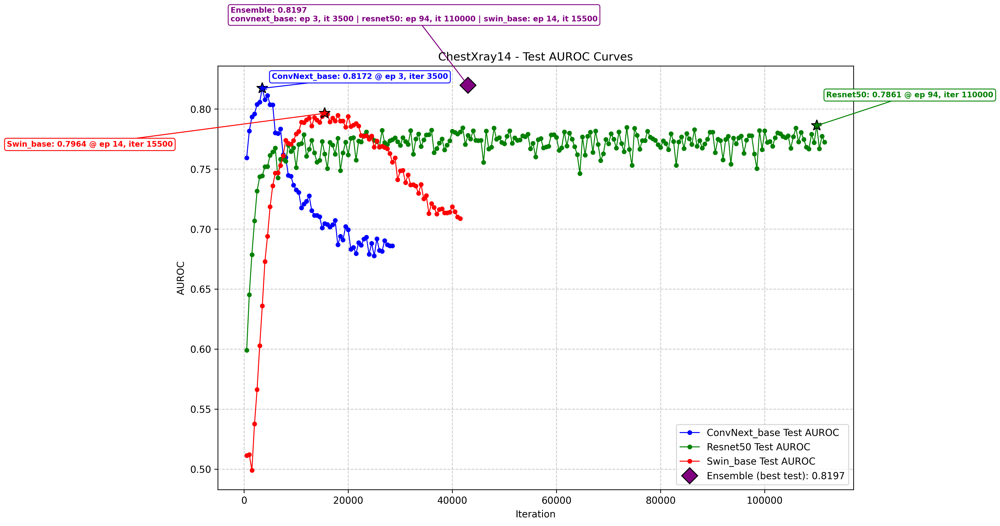
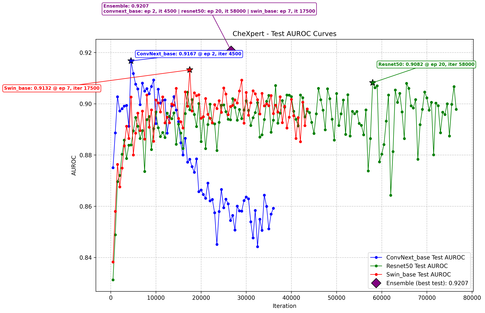
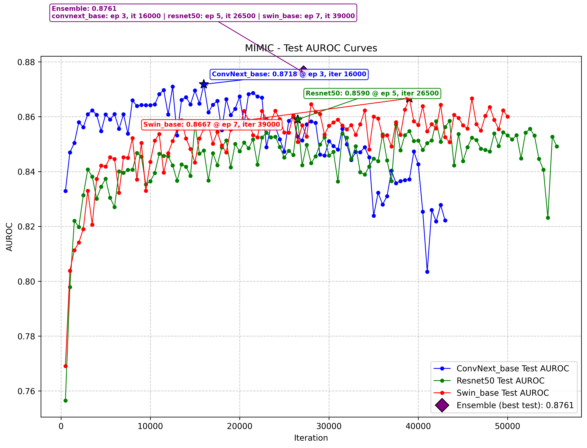

# Best Test AUROC — Per-backbone learning curves with ensemble point

Each backbone is shown at every saved checkpoint. The star (★) marks the backbone's own
best-test checkpoint. The diamond (◆) is the ensemble of all three best-test checkpoints.
The ensemble textbox above the plot lists which epoch/iteration each backbone contributed.

## ChestXray14

## CheXpert

## MIMIC

